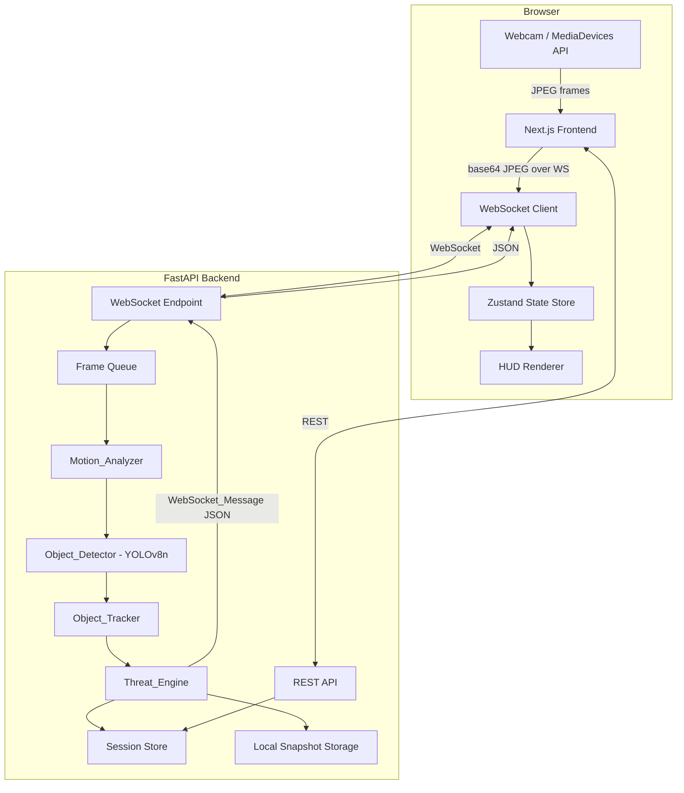
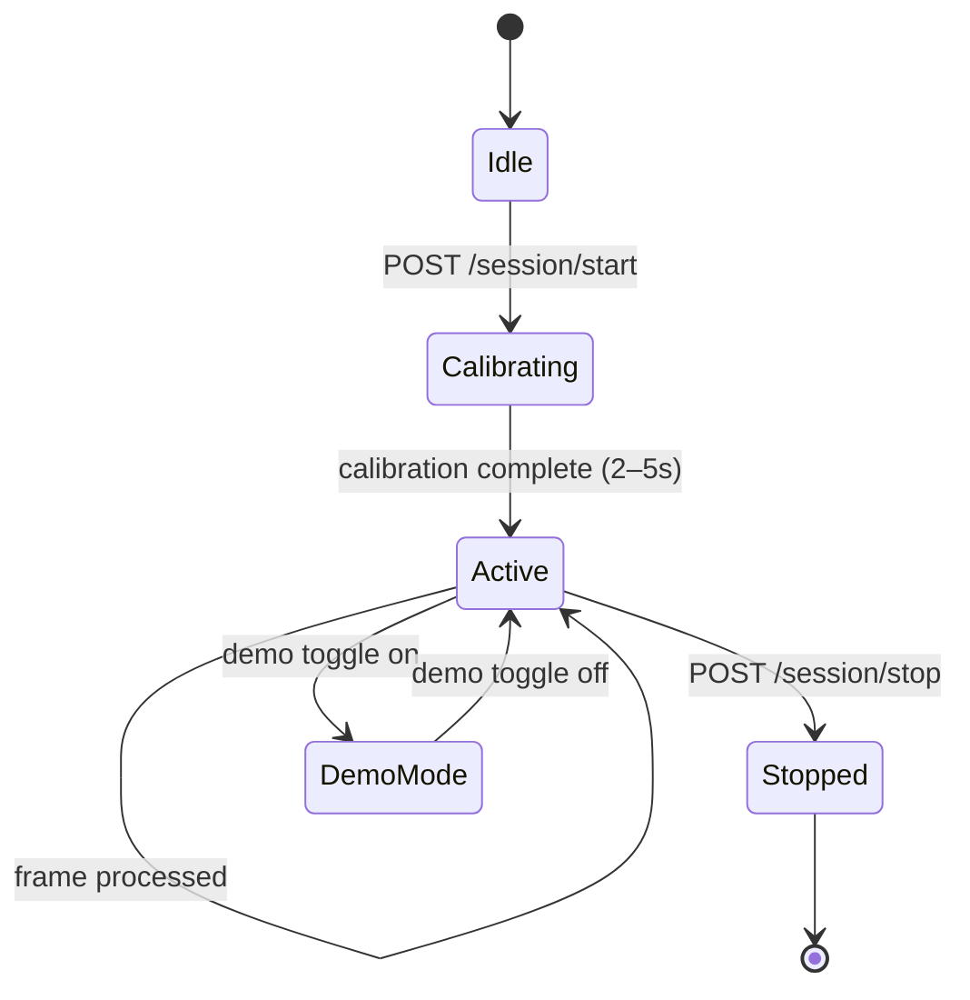
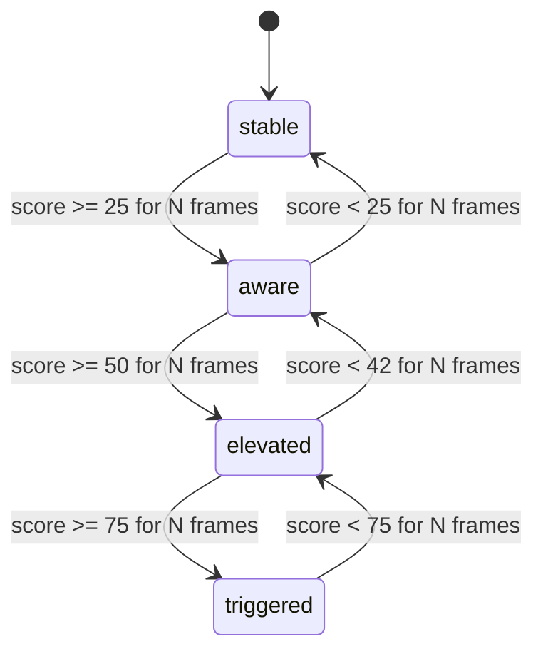

# Design Document: Spider-Sense AI

## Overview

Spider-Sense AI is a real-time computer vision threat-awareness system composed of two services:

- **Frontend**: Next.js 15+ / React 19+ application that captures webcam frames, renders the cinematic HUD, and communicates with the backend over WebSocket.
- **Backend**: FastAPI / Python 3.11+ service that performs frame analysis (motion, object detection, tracking, threat scoring) and streams results back to the frontend.

The system is designed for local-only operation — no video data leaves the user's machine. The architecture prioritizes low-latency frame processing (sub-150ms end-to-end), modular backend subsystems with typed interfaces, and a visually polished HUD suitable for social content creation.

### Key Design Goals

- Sub-150ms WebSocket round-trip from frame capture to HUD update
- Modular backend pipeline: Motion_Analyzer → Object_Detector → Object_Tracker → Threat_Engine
- Typed contracts throughout: Pydantic v2 on the backend, TypeScript interfaces on the frontend
- Single `docker compose up` deployment
- Graceful degradation on lower-end hardware

---

## Architecture

### System Topology



### Processing Pipeline

Each frame flows through a sequential pipeline on the backend:

```
Frame In → Motion_Analyzer → Object_Detector → Object_Tracker → Threat_Engine → WebSocket_Message Out
```

The pipeline runs synchronously per frame within an async FastAPI background task. Frames that arrive while the pipeline is busy are dropped (not queued) to prevent latency accumulation.

### Session Lifecycle



### Threat Level State Machine



---

## Components and Interfaces

### Backend Components

#### Motion_Analyzer

Receives a decoded frame (numpy array) and the calibration baseline. Returns a `MotionSignals` Pydantic model.

```python
class MotionSignals(BaseModel):
    motion_intensity: float        # [0.0, 1.0] baseline-subtracted
    motion_suddenness: float       # rate of change over rolling window
    dominant_direction: str        # left | right | top | bottom | center-left | center-right | center | multi-zone
    zones_active: list[str]        # active grid zone identifiers
    contour_area_fraction: float   # fraction of frame covered by motion contours
```

Implementation uses OpenCV frame differencing (or dense optical flow) with a configurable rolling window for temporal smoothing. Calibration baseline is subtracted before emitting signals.

#### Object_Detector

Receives a decoded frame. Returns a list of `DetectedObject` models.

```python
class DetectedObject(BaseModel):
    object_id: str                 # temporary ID before tracker assignment
    class_label: str               # person | hand | cell phone | chair | backpack | bottle | laptop | unknown
    confidence: float
    bbox: BoundingBox              # x, y, w, h normalized [0,1]
    is_unknown_moving_region: bool
```

Runs YOLOv8n via the `ultralytics` library. Filters detections below the configured confidence threshold. Emits `unknown moving region` entries for motion contours with no matched class.

#### Object_Tracker

Receives the list of `DetectedObject` and the previous tracking state. Returns a list of `TrackedObject` models.

```python
class TrackedObject(BaseModel):
    track_id: int
    class_label: str
    bbox: BoundingBox
    bbox_growth_rate: float        # change in area per frame
    approaching: bool
    velocity_hint: str             # "moving fast toward center" | "stationary" | "moving left" | ...
    path: list[tuple[float, float]] # center positions over tracking window
```

Uses IoU-based bounding box overlap for ID assignment. Expires IDs after a configurable timeout. Computes approach velocity from bbox area growth rate.

#### Threat_Engine

Receives `MotionSignals` and `list[TrackedObject]`. Returns a `ThreatAssessment` model.

```python
class ThreatAssessment(BaseModel):
    threat_score: int              # [0, 100]
    threat_level: str              # stable | aware | elevated | triggered
    direction: str
    event_reasons: list[str]
    snapshot_saved: bool
    degraded: bool
```

Applies the weighted formula, exponential smoothing, sensitivity scaling, and hysteresis state machine. Triggers snapshot capture when threshold is crossed.

#### WebSocket_Message (full contract)

```python
class WebSocketMessage(BaseModel):
    timestamp: str                 # ISO 8601
    frame_id: int
    threat_score: int              # [0, 100]
    threat_level: str              # stable | aware | elevated | triggered
    direction: str
    motion_intensity: float
    motion_suddenness: float
    approach_velocity: float
    center_proximity: float
    zones_active: list[str]
    objects: list[TrackedObject]
    event_reasons: list[str]
    snapshot_saved: bool
    degraded: bool
```

#### REST Endpoints

| Method | Path | Description |
|--------|------|-------------|
| GET | /health | Service status and version |
| POST | /session/start | Initialize session, return session_id |
| POST | /session/stop | Finalize session, compute summary |
| GET | /session/latest | Most recent session summary |
| GET | /session/:id/events | Full event list for session |
| POST | /demo/trigger | Inject synthetic threat event |
| POST | /settings | Update sensitivity and snapshot threshold |

All request/response bodies are validated by Pydantic v2. Invalid bodies return HTTP 422.

### Frontend Components

#### HUD Renderer

React component tree:

```
<HUDRoot>
  ├── <CameraViewport>        # live video element + canvas overlay
  ├── <ThreatRing>            # animated SVG ring scaled to threat_score
  ├── <Reticle>               # center crosshair with pulse animation
  ├── <DirectionalArc>        # SVG arc segment indicating threat direction
  ├── <ThreatScoreDisplay>    # numeric score + threat_level label
  ├── <ThreatTimeline>        # recharts/canvas time-series chart
  ├── <EventLogPanel>         # rolling 50-entry log (right panel)
  ├── <ControlPanel>          # sensitivity, audio, demo, export toggles
  └── <StatusBar>             # calibration progress, perf warning, privacy notice
```

#### Zustand State Store

```typescript
interface SpiderSenseStore {
  // Session
  sessionId: string | null;
  sessionState: 'idle' | 'calibrating' | 'active' | 'stopped';

  // Live threat data
  latestMessage: WebSocketMessage | null;
  threatScore: number;
  threatLevel: ThreatLevel;
  direction: string;
  eventReasons: string[];

  // Event log
  eventLog: EventLogEntry[];       // max 50 entries

  // Timeline
  timelineData: TimelinePoint[];   // last 20–60s

  // Settings
  sensitivity: 'low' | 'medium' | 'high';
  audioEnabled: boolean;
  demoMode: boolean;
  exportMode: boolean;

  // Performance
  messageRate: number;             // messages/sec
  performanceWarning: boolean;

  // Actions
  appendEvent: (msg: WebSocketMessage) => void;
  updateSettings: (settings: Partial<Settings>) => void;
  setSessionState: (state: SessionState) => void;
}
```

#### WebSocket Client

Manages the WebSocket connection lifecycle:
- Connects on session start
- Sends JPEG frames as base64-encoded JSON messages
- Receives `WebSocketMessage` JSON and dispatches to Zustand store
- Implements exponential backoff reconnection (max 30s interval)

#### TypeScript Interfaces

```typescript
interface WebSocketMessage {
  timestamp: string;
  frame_id: number;
  threat_score: number;
  threat_level: ThreatLevel;
  direction: ThreatDirection;
  motion_intensity: number;
  motion_suddenness: number;
  approach_velocity: number;
  center_proximity: number;
  zones_active: string[];
  objects: TrackedObject[];
  event_reasons: string[];
  snapshot_saved: boolean;
  degraded: boolean;
}

type ThreatLevel = 'stable' | 'aware' | 'elevated' | 'triggered';
type ThreatDirection = 'left' | 'right' | 'top' | 'bottom' | 'center-left' | 'center-right' | 'center' | 'multi-zone';

interface TrackedObject {
  track_id: number;
  class_label: string;
  bbox: BoundingBox;
  bbox_growth_rate: number;
  approaching: boolean;
  velocity_hint: string;
}

interface BoundingBox {
  x: number; y: number; w: number; h: number;
}

interface EventLogEntry {
  timestamp: string;
  threat_level: ThreatLevel;
  direction: ThreatDirection;
  event_reasons: string[];
}

interface TimelinePoint {
  timestamp: number;   // epoch ms
  threat_score: number;
  is_spike: boolean;
  snapshot_saved: boolean;
}

interface SessionSummary {
  session_id: string;
  total_alerts: number;
  highest_threat_score: number;
  average_threat_score: number;
  top_direction: ThreatDirection;
  total_snapshots: number;
  dominant_event_reason: string;
}
```

---

## Data Models

### Backend Pydantic Models

#### Calibration Baseline

```python
class CalibrationBaseline(BaseModel):
    avg_motion_level: float
    avg_brightness: float
    noise_floor: float
    reference_objects: list[DetectedObject]
    frame_count: int
    stable: bool
```

#### Session

```python
class Session(BaseModel):
    session_id: str                # UUID4
    started_at: datetime
    ended_at: datetime | None
    state: Literal['calibrating', 'active', 'stopped']
    events: list[SessionEvent]
    snapshots: list[SnapshotRecord]
    summary: SessionSummary | None
```

#### SessionEvent

```python
class SessionEvent(BaseModel):
    event_id: str
    session_id: str
    timestamp: datetime
    frame_id: int
    threat_score: int
    threat_level: str
    direction: str
    event_reasons: list[str]
    snapshot_saved: bool
```

#### SnapshotRecord

```python
class SnapshotRecord(BaseModel):
    snapshot_id: str
    session_id: str
    timestamp: datetime
    threat_score: int
    threat_level: str
    file_path: str                 # local filesystem path
```

#### SessionSummary

```python
class SessionSummary(BaseModel):
    session_id: str
    total_alerts: int
    highest_threat_score: int
    average_threat_score: float
    top_direction: str
    total_snapshots: int
    dominant_event_reason: str
```

#### Settings

```python
class Settings(BaseModel):
    sensitivity: Literal['low', 'medium', 'high'] = 'medium'
    snapshot_threshold: int = 50   # [0, 100]
    fps_cap: int = 15
    smoothing_alpha: float = 0.3   # exponential smoothing
    hysteresis_frames: int = 3     # N frames for level transition
    confidence_threshold: float = 0.4
    approach_threshold: float = 0.05
    tracker_timeout_frames: int = 10
```

### Frontend Storage

All frontend state is ephemeral (Zustand in-memory). Session summaries and event history are fetched from the backend REST API. No video frames are persisted on the frontend.

### Persistence Strategy

The backend uses an in-process dictionary store for the current session (fast, no DB dependency). Session data is serialized to JSON files on disk at session stop. Snapshots are stored as JPEG files under `./data/snapshots/{session_id}/`. This keeps the system dependency-free (no database required) while satisfying the local-only privacy requirement.

```
./data/
  sessions/
    {session_id}.json          # SessionSummary + events
  snapshots/
    {session_id}/
      {snapshot_id}.jpg
```

---

## Correctness Properties

*A property is a characteristic or behavior that should hold true across all valid executions of a system — essentially, a formal statement about what the system should do. Properties serve as the bridge between human-readable specifications and machine-verifiable correctness guarantees.*

### Property 1: MotionSignals completeness and range

*For any* decoded video frame passed to the Motion_Analyzer, the returned `MotionSignals` object must contain all required fields, `motion_intensity` must be in [0.0, 1.0], `contour_area_fraction` must be in [0.0, 1.0], and `dominant_direction` must be one of the 8 defined direction strings.

**Validates: Requirements 3.1, 3.2, 3.3, 3.4, 3.5**

### Property 2: Baseline subtraction reduces apparent motion

*For any* frame and calibration baseline, the baseline-subtracted `motion_intensity` emitted by the Motion_Analyzer must be less than or equal to the raw motion intensity computed from the same frame without baseline subtraction.

**Validates: Requirements 3.6**

### Property 3: Temporal smoothing reduces variance

*For any* sequence of frames with high-variance raw motion values, the smoothed `motion_intensity` series produced by the Motion_Analyzer must have lower or equal variance than the raw series over the same window.

**Validates: Requirements 3.7**

### Property 4: DetectedObject completeness and class domain

*For any* frame passed to the Object_Detector, every returned `DetectedObject` must have a non-empty `class_label` from the defined set (person, hand, cell phone, chair, backpack, bottle, laptop, unknown), a `confidence` value in [0.0, 1.0], and a valid `bbox`. No object with `confidence` below the configured threshold may appear in the results.

**Validates: Requirements 4.1, 4.2, 4.4**

### Property 5: TrackedObject completeness and ID stability

*For any* sequence of frames where the same physical object appears in consecutive frames, the Object_Tracker must assign the same `track_id` across those frames, and every `TrackedObject` in the output must have a non-empty `velocity_hint`, a valid `bbox_growth_rate`, and a non-empty `path`.

**Validates: Requirements 5.1, 5.2, 5.3, 5.6**

### Property 6: Approach flag invariant

*For any* tracked object whose `bbox_growth_rate` exceeds the configured approach threshold, the `approaching` flag must be `true`. Conversely, for any tracked object whose `bbox_growth_rate` is at or below the threshold, `approaching` must be `false`.

**Validates: Requirements 5.4**

### Property 7: Threat score formula correctness

*For any* set of input signals (motion_intensity, motion_suddenness, approach_velocity, center_proximity, bbox_growth, new_entity_bonus, multi_zone_bonus) and sensitivity scaling factor, the raw threat score computed by the Threat_Engine must equal the value produced by the defined weighted formula applied to the sensitivity-scaled inputs, within floating-point tolerance.

**Validates: Requirements 6.1, 6.4**

### Property 8: Threat score range invariant

*For any* input signals and any sensitivity level, the final `threat_score` emitted in every `WebSocketMessage` must be an integer in [0, 100].

**Validates: Requirements 6.2, 6.5**

### Property 9: Exponential smoothing bounds

*For any* previous smoothed score `s_prev` and current raw score `s_raw`, the new smoothed score `s_new` produced by the Threat_Engine must satisfy `min(s_prev, s_raw) <= s_new <= max(s_prev, s_raw)`. That is, the smoothed value must always lie between the previous and current raw values.

**Validates: Requirements 6.3**

### Property 10: Sensitivity scaling is monotone

*For any* fixed set of input signals, the threat score computed with `high` sensitivity must be greater than or equal to the score computed with `medium` sensitivity, which must be greater than or equal to the score computed with `low` sensitivity. The scaling factors must exactly match: low=0.6, medium=1.0, high=1.5.

**Validates: Requirements 6.4, 13.3, 13.4**

### Property 11: Threat level mapping invariant

*For any* `threat_score` value, the `threat_level` emitted in the `WebSocketMessage` must match the defined mapping: 0–24 → stable, 25–49 → aware, 50–74 → elevated, 75–100 → triggered. This must hold for every message emitted.

**Validates: Requirements 7.1, 7.5**

### Property 12: Hysteresis state machine correctness

*For any* sequence of threat scores, the Threat_Engine's level transitions must satisfy: (a) a level only increases after N consecutive frames above the upper threshold, (b) a level only decreases after N consecutive frames below the lower hysteresis threshold (42 for elevated→aware), and (c) a single frame above/below threshold must not cause a transition.

**Validates: Requirements 7.2, 7.3, 7.4**

### Property 13: Direction domain invariant

*For any* frame processed by the Threat_Engine, the `direction` field in every emitted `WebSocketMessage` must be one of the 8 defined values: left, right, top, bottom, center-left, center-right, center, multi-zone.

**Validates: Requirements 8.1, 8.2, 8.4**

### Property 14: Event reasons domain constraint

*For any* frame processed by the Threat_Engine, the `event_reasons` field must be a list (possibly empty). Every string in a non-empty list must be from the defined set of 8 reason strings. When all input signals are at or below baseline, `event_reasons` must be empty.

**Validates: Requirements 9.1, 9.2, 9.3**

### Property 15: Event log bounded size

*For any* sequence of WebSocket messages received by the frontend, the `eventLog` in the Zustand store must never exceed 50 entries. When a 51st entry would be added, the oldest entry must be discarded first.

**Validates: Requirements 10.1, 10.4**

### Property 16: Event log append round-trip

*For any* `WebSocketMessage` with a non-empty `event_reasons` list, after the frontend processes that message, the event log must contain an entry with the matching timestamp, threat_level, direction, and event_reasons.

**Validates: Requirements 10.2**

### Property 17: Timeline append round-trip

*For any* `WebSocketMessage` received by the frontend, the `timelineData` array in the Zustand store must contain a `TimelinePoint` with the matching `threat_score` and a timestamp within 1 second of the message timestamp.

**Validates: Requirements 11.2**

### Property 18: Snapshot trigger and rate limiting

*For any* frame where the `threat_score` crosses the snapshot threshold from below, `snapshot_saved` must be `true` in the corresponding `WebSocketMessage`. For any sequence of frames where the score remains continuously above the threshold, consecutive `snapshot_saved=true` messages must be at least 3 seconds apart.

**Validates: Requirements 12.1, 12.2, 12.6**

### Property 19: No frames transmitted before activation

*For any* frontend state before the user activates the "Initialize System" control, the WebSocket client must not have sent any frame data to the backend.

**Validates: Requirements 1.5**

### Property 20: No threat alerts during calibration

*For any* frame processed while the session is in `calibrating` state, the backend must not emit a `WebSocketMessage` with a non-empty `event_reasons` list or a `threat_level` other than `stable`.

**Validates: Requirements 2.4**

### Property 21: Calibration baseline completeness

*For any* completed calibration run, the resulting `CalibrationBaseline` object must contain valid (non-None, non-NaN) values for all four fields: `avg_motion_level`, `avg_brightness`, `noise_floor`, and `reference_objects`.

**Validates: Requirements 2.3**

### Property 22: Calibration duration bounds

*For any* calibration run under normal conditions, the duration must be between 2 and 5 seconds. When high-motion frames are injected, the duration may extend up to 8 seconds (5 + 3 extension) but must not exceed that.

**Validates: Requirements 2.2, 2.6**

### Property 23: WebSocket message schema completeness

*For any* processed frame, the emitted `WebSocketMessage` must contain all 15 defined fields with correct types: timestamp (ISO 8601 string), frame_id (int), threat_score (int), threat_level (string), direction (string), motion_intensity (float), motion_suddenness (float), approach_velocity (float), center_proximity (float), zones_active (string array), objects (array), event_reasons (string array), snapshot_saved (bool), degraded (bool).

**Validates: Requirements 19.1, 19.2**

### Property 24: REST API rejects invalid input

*For any* malformed or type-invalid request body sent to any REST endpoint, the backend must return HTTP 422 with a Pydantic validation error response body.

**Validates: Requirements 20.8**

### Property 25: Pydantic validation enforced at module boundaries

*For any* data object passed between backend modules (Motion_Analyzer → Object_Detector → Object_Tracker → Threat_Engine), passing an object with missing required fields or wrong field types must raise a Pydantic `ValidationError` rather than silently propagating invalid data.

**Validates: Requirements 24.3**

---

## Error Handling

### Backend Error Handling

| Scenario | Behavior |
|----------|----------|
| Frame decode failure | Log warning, skip frame, do not emit WebSocket_Message |
| YOLOv8n inference timeout | Emit message with `degraded=true`, use previous detection results |
| Frame processing exceeds target interval | Drop incoming frame, do not queue |
| WebSocket client disconnects | Close session cleanly, persist partial session data |
| Calibration receives only high-motion frames | Extend window up to 3s; if still noisy, use best available baseline and log warning |
| Snapshot storage write failure | Log error, set `snapshot_saved=false`, continue processing |
| Invalid REST request body | Return HTTP 422 with Pydantic validation error detail |
| Session not found for GET /session/:id/events | Return HTTP 404 |
| Demo mode trigger when not in demo mode | Return HTTP 400 |

### Frontend Error Handling

| Scenario | Behavior |
|----------|----------|
| `getUserMedia` denied | Display permission troubleshooting UI with specific error reason |
| Camera device unavailable | Display device unavailable error with remediation steps |
| WebSocket connection lost | Display reconnecting indicator; retry with exponential backoff (max 30s) |
| WebSocket message parse failure | Log to console, skip message, do not update store |
| Message rate drops below 5/sec | Display performance warning indicator in HUD |
| REST API call fails | Display inline error in relevant control panel section |
| Audio playback blocked by browser policy | Silently disable audio, show tooltip explaining browser autoplay policy |

### Graceful Degradation Strategy

The system degrades in the following priority order to maintain HUD responsiveness:

1. Reduce YOLO input resolution (e.g., 640→320→160px)
2. Reduce inference frequency (run YOLO every N frames, interpolate between)
3. Fall back to motion-only threat scoring (skip object detection entirely)
4. Drop frames at the backend queue level
5. Display `degraded=true` indicator in HUD

---

## Testing Strategy

### Dual Testing Approach

The system uses both unit tests and property-based tests. They are complementary:

- **Unit tests** verify specific examples, integration points, and error conditions
- **Property-based tests** verify universal invariants across randomly generated inputs

### Backend Testing (Python)

**Property-based testing library**: `hypothesis` (with `hypothesis-jsonschema` for schema testing)

Each property test runs a minimum of 100 iterations (`@settings(max_examples=100)`).

**Property test tag format**: `# Feature: spider-sense-ai, Property {N}: {property_text}`

Property tests to implement:

| Property | Test Description |
|----------|-----------------|
| P1: MotionSignals range | Generate random frames; assert all fields in valid ranges and direction in defined set |
| P2: Baseline subtraction | Generate frame + baseline; assert subtracted intensity <= raw intensity |
| P3: Temporal smoothing variance | Generate frame sequences; assert smoothed variance <= raw variance |
| P4: DetectedObject domain | Generate frames; assert all detections have valid class, confidence >= threshold, valid bbox |
| P5: TrackedObject completeness | Generate frame sequences with consistent objects; assert ID stability and field completeness |
| P6: Approach flag | Generate tracked objects with varying growth rates; assert approaching matches threshold comparison |
| P7: Formula correctness | Generate random signal tuples; assert computed score matches formula |
| P8: Score range | Generate arbitrary signals; assert threat_score always in [0, 100] |
| P9: Smoothing bounds | Generate (prev_score, raw_score) pairs; assert smoothed is between them |
| P10: Sensitivity monotone | Generate signals; assert high >= medium >= low scores; assert exact scaling factors |
| P11: Level mapping | Generate scores 0–100; assert level matches defined ranges |
| P12: Hysteresis | Generate score sequences; assert transitions only after N consecutive frames |
| P13: Direction domain | Generate frames; assert direction always in defined 8-value set |
| P14: Event reasons domain | Generate signal tuples; assert reasons are from defined set; assert empty when signals at baseline |
| P15: Event log bounded | Generate sequences of >50 messages; assert log length never exceeds 50 |
| P16: Event log round-trip | Generate messages with event_reasons; assert log contains matching entry |
| P17: Timeline round-trip | Generate messages; assert timeline contains matching point |
| P18: Snapshot rate limiting | Generate high-score frame sequences; assert consecutive snapshots >= 3s apart |
| P21: Calibration completeness | Generate frame sequences; assert baseline has all required fields |
| P22: Calibration duration | Generate frame sequences with varying noise; assert duration in [2, 8]s |
| P23: Message schema | Generate processed frames; assert all 15 fields present with correct types |
| P24: REST 422 | Generate invalid request bodies; assert HTTP 422 response |
| P25: Pydantic validation | Generate objects with missing/wrong fields; assert ValidationError raised |

**Unit tests** cover:
- Session lifecycle (start → calibrate → active → stop)
- Demo mode synthetic event injection
- Snapshot file creation and association with session
- REST endpoint happy paths (health, session CRUD)
- WebSocket connection and clean close
- Frame drop behavior under load
- Calibration extension when high-motion frames are detected

### Frontend Testing (TypeScript)

**Property-based testing library**: `fast-check`

Each property test runs a minimum of 100 iterations (default `fast-check` configuration).

**Property test tag format**: `// Feature: spider-sense-ai, Property {N}: {property_text}`

Property tests to implement:

| Property | Test Description |
|----------|-----------------|
| P15: Event log bounded | Generate >50 appendEvent calls; assert store eventLog.length <= 50 |
| P16: Event log round-trip | Generate WebSocketMessage with event_reasons; assert log entry matches |
| P17: Timeline round-trip | Generate WebSocketMessage; assert timelineData contains matching point |
| P19: No frames before activation | Assert WebSocket send not called before sessionState === 'active' |
| P20: No alerts during calibration | Generate messages during calibrating state; assert no alert UI rendered |

**Unit tests** cover:
- Camera initialization flow (mock getUserMedia)
- Permission denied error UI rendering
- WebSocket reconnection with exponential backoff
- HUD component rendering for each ThreatLevel
- DirectionalArc renders correct segment for each direction
- Audio alert plays on elevated/triggered transitions
- Audio suppressed when audioEnabled=false
- Export mode hides developer controls
- Demo mode indicator visible when demoMode=true
- Sensitivity control transmits correct value to backend
- Accessibility: all controls have ARIA labels, focus indicators present
- Threat level indicators use icon + color (not color alone)

### Integration Tests

- Full pipeline: frame in → WebSocket_Message out (backend integration)
- Session start → calibration → active → stop → summary (end-to-end session lifecycle)
- Snapshot capture: score crosses threshold → file exists on disk
- Settings update: POST /settings → next frame uses new sensitivity
- Demo mode: POST /demo/trigger → synthetic message emitted

### Test Configuration

```python
# Backend: conftest.py
from hypothesis import settings
settings.register_profile("ci", max_examples=100)
settings.load_profile("ci")
```

```typescript
// Frontend: vitest.config.ts
// fast-check default numRuns=100 is sufficient
// Run with: vitest --run
```
